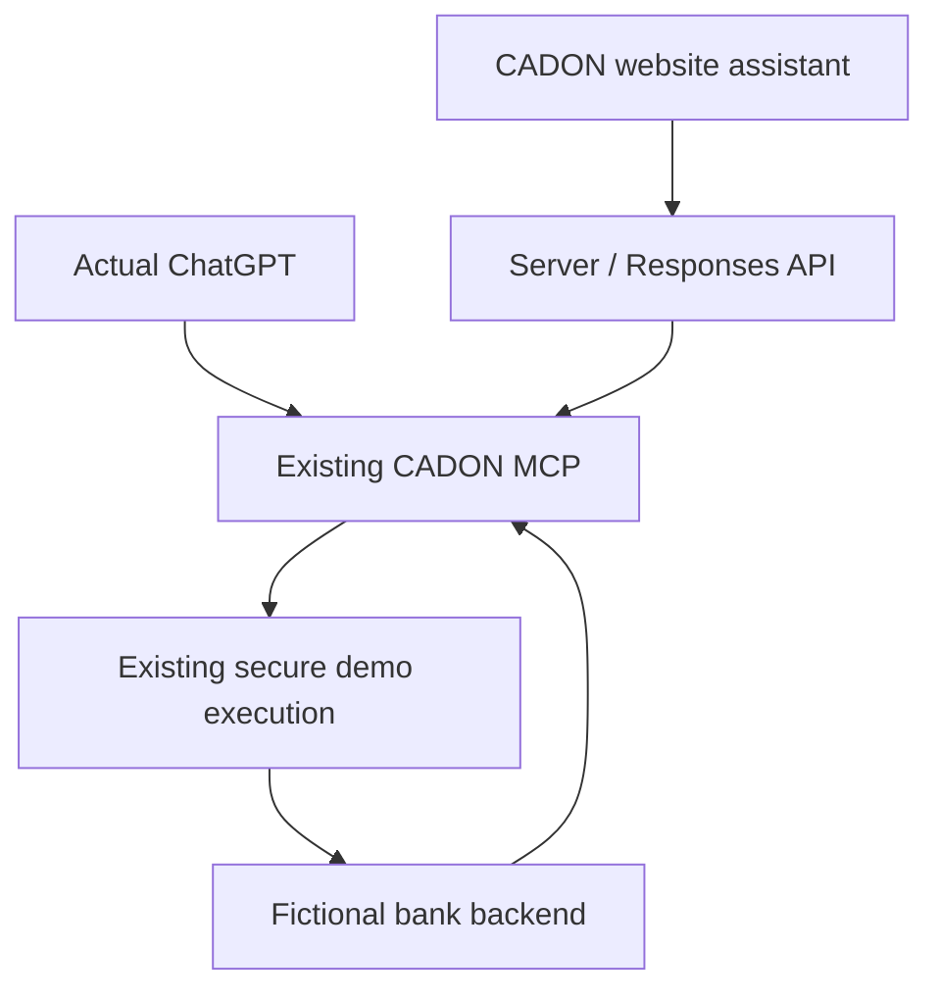

# CADON dual-experience implementation — 3 October 2026

## Status

The website implementation is complete and passes compilation and offline security/streaming checks. Direct tests reached the real CADON MCP, read its UI resource, created a launch and retrieved its real pending status. **Neither a live OpenAI conversation nor a signed-in ChatGPT conversation has been verified.** No OPENAI_API_KEY is available in this workspace. Vercel project/environment access is unavailable through the connected account. Hosted MCP routing defects below also prevent declaring all acceptance criteria satisfied.

## Architecture before and after

Before: Next.js 16.2.4 / React 19 marketing site, HMAC access gate, copied ChatGPT prompt, direct fixed car-loan launch and status routes. The old website simulator had already been retired. Execution runs separately on Fly at `https://cadon-demo.fly.dev/mcp`; its source is absent from this repository.

After: `/demo` provides natural-language input, streamed responses, approval cards, actual structured provider cards, explicit secure-session links, owned-launch result checks, conversation continuity and optional developer view. `/demo/chatgpt` is a public connection guide for the existing MCP inside actual ChatGPT. The homepage links both experiences prominently.

The website renders its own cards from MCP outputs. ChatGPT uses the existing advertised UI resource. No ChatGPT iframe, duplicate execution backend or scripted production chat was introduced.

## MCP discovery

Live server: `cadon`, version `1.28.1`, streamable HTTP. `docs/mcp-schema.json` contains the complete discovered input/output schemas, descriptions and annotations; `docs/mcp-resources.json` records advertised resources. All 14 exposed tools:

| Tool | Existing purpose |
| --- | --- |
| `list_cadon_demo_scenarios` | Lists supported fictional journeys and aliases. |
| `prepare_cadon_context` | Checks safe preferences, returns missing questions and a preflight token. |
| `get_cadon_conversation_guide` | Returns conversation guidance for a journey. |
| `show_car_loan_bank_options` | Car-loan provider cards after preflight. |
| `show_cadon_demo_offers` | Generic journey cards, including renovation aliases. |
| `show_personal_loan_options` | Personal lending cards after preflight. |
| `show_mortgage_options` | Mortgage cards after preflight. |
| `show_savings_account_options` | Savings cards after preflight. |
| `show_start_investing_options` | Investment cards after preflight. |
| `show_send_money_options` | Fictional transfer workflow cards after preflight. |
| `resume_cadon_session` | Searches/resumes saved sessions; excluded from website until ownership isolation is established. |
| `get_car_loan_demo_link` | Legacy car-finance launch link. |
| `get_cadon_demo_link` | Scenario-specific launch reference and browser URL. |
| `get_demo_result` | Minimal mock outcome for a launch/session. |

Current UI: `ui://cadon/offer-cards-v0.46.html`, MIME `text/html;profile=mcp-app`, advertised through both MCP Apps and OpenAI output-template metadata, with CSP and legacy aliases. `resources/read` succeeded. Its instructions require the assistant to return no additional prose after rendering cards. Actual rendering inside ChatGPT remains untested.

## Option 1

- Native server `fetch` to OpenAI `/v1/responses`: remote MCP tool, live schema discovery, 13-tool allowlist, `require_approval: "always"`, streaming, previous response continuity. Default model `gpt-5.6-terra`, configurable server-side.
- The assistant follows preflight, uses current user-confirmed preferences, suppresses prose after cards and must not invent results. Ambiguous/inconsistent backend context requires clarification.
- AES-256-GCM state includes response references, pending approvals and launch IDs. It is opaque to the client, tied to the authenticated access cookie, and expires after two hours. The transcript is held in tab sessionStorage with a size cap. Credentials and raw tool arguments never reach the UI.
- Tool cards display whitelisted fields. Links allow only HTTPS at the configured MCP origin with `/demo/` or `/s/`, or `https://exec.cadon.io`; links require explicit clicks. Status approval rejects session IDs and launch IDs not issued to this conversation, and requires an explicit wait of 0–2 seconds.
- Every tool call needs visitor approval before preferences are sent to CADON. Separate execution confirmation remains in the existing CADON flow. Failed upstream requests preserve outstanding approvals for retry.
- Access gate, same-origin checks, bounded JSON/message sizes, heuristic email/IBAN/card filtering, 30 requests/15 min per network address, daily 300-request budget, 40-turn state limit, 2,500 output tokens, six tool calls/response, 110-second timeout. Redis is necessary for shared serverless limits; otherwise counters are per process. Stateless state can be replayed/forked, so its turn cap is not a billing security boundary. Set provider project spending limits too.
- Analytics count daily named events/capabilities in Redis with 30-day expiry. No message text, amounts, contact details or launch IDs are included. Analytics is inactive without Redis. Link clicks indicate attempted starts, not proof that an external session opened. Completion counts require MCP status `completed`; no synthetic completion events.

## Option 2

No hosted MCP code changed: the existing tools, structured results, descriptions and widget are reused. Public connection instructions follow current OpenAI documentation: enable Developer mode under Settings → Security and login where permitted, create a connection in ChatGPT Plugins using the HTTPS MCP URL, review discovery, then enable it in a new conversation. Account/workspace policy may restrict this. The website cannot install a connection or authorize ChatGPT on behalf of a visitor.

The MCP remains independent of ChatGPT. Its presentation metadata is additive; the core tools remain callable by other compatible MCP clients. The website gate does not protect the public MCP or URLs already handed to visitors.

## Required scenario results

`docs/mcp-validation.json` records actual direct-MCP observations. Offline fixtures test transport/rendering and are never runtime fallbacks.

| Required scenario | Direct live MCP evidence | Website OpenAI E2E | Actual ChatGPT E2E |
| --- | --- | --- | --- |
| €25,000 car | Detects `car_loan`, asks new/used; complete explicit car context returns 10 actual fictional cards and links. | Blocked: API key absent. | Not run: connected signed-in client unavailable. |
| €20,000 renovation | Resolves `cj_008` / `show_cadon_demo_offers`; incorrectly infers Nova preference from “renovate”. Backend defect. | Blocked. | Not run. |
| Savings account | Automatic detection returns generic `cj_001`; explicit `savings_account` uses correct tool and asks provider preference. Backend detection defect. | Blocked. | Not run. |
| €30,000 car → €22,000 | Combined exact query resolves personal lending and retains 30,000. Explicit current car recap resolves car loan / 22,000 and returns cards. Backend parsing defect. | Blocked; prompt uses current recap, but not verified with a model. | Not run. |
| Unsupported: concert tickets | Direct preflight falls back to personal lending. Assistant must consult capability list instead of assuming support. Backend default-routing defect. | Prompt and tool allowlist checked offline; model behavior unverified. | Not run. |
| MCP failure | Unknown launch returns pending/not_opened rather than not_found, so absence is not proof of a valid session. Error adapter rejects malformed/isError payloads; injected upstream outage produces an explicit error and preserves approval. | Offline error boundary passed; live model/MCP outage not run. | Not run. |

Additional checks: real unopened car launch returns `status=pending`, `state=not_opened`; current UI resource reads successfully. No demo workflow was completed or represented as a real lending decision.

Validation commands: `npm run lint`, `npx tsc --noEmit`, `npm run build`, `node scripts/test-chat.cjs`, `node scripts/verify-http.cjs`. HTTP verification exercises the built gate, invalid code, signed login, authenticated chat render, unauthenticated chat rejection and explicit missing-key response. Browser visual/mobile verification is blocked in this execution environment: agent-browser could not start its daemon under the available socket restrictions. Responsive CSS is implemented but browser acceptance is not claimed.

## Changed files

- `src/components/DemoSession.tsx`, `DemoGate.tsx`, `DemoLink.tsx`: conversation, approvals, cards, two entry points.
- `src/app/api/demo-chat/route.ts`, `demo-events/route.ts`: streaming model/MCP bridge and aggregate event endpoint.
- `src/lib/chat-{types,state,output,prompt}.ts`, `sse.ts`, `demo-{events,metrics}.ts`: bounded state, adapters, instructions, framing, analytics.
- `src/lib/request-security.ts`: parameterized body size limit.
- `src/app/demo/chatgpt/page.tsx`, `demo/error.tsx`: actual ChatGPT setup and error boundary.
- `src/app/page.tsx`, `globals.css`, `privacy/page.tsx`, `sitemap.ts`, `robots.ts`: positioning, styling, disclosures and discoverability.
- `.env.example`, `README.md`, these docs and `scripts/`: configuration, discovery and reproducible checks.

## Environment / deployment

Required server secrets: `CADON_DEMO_ACCESS_CODE`, `CADON_DEMO_SESSION_SECRET` (random, at least 32 characters), `OPENAI_API_KEY`. Optional `OPENAI_MODEL`; default `gpt-5.6-terra`. MCP URL defaults to the inspected endpoint; `CADON_MCP_TOKEN` only if upstream authentication is enabled. For public production, configure `UPSTASH_REDIS_REST_URL` and `UPSTASH_REDIS_REST_TOKEN` for shared limits and analytics.

No secrets are committed or prefixed NEXT_PUBLIC_. OpenAI must be configured in Vercel Production then redeployed. The previously observed access failure was independent: the signing secret was too short. A fresh live configuration probe on 3 October now returns 401 for an intentionally incorrect code, confirming that both required access variables pass configuration validation. This does not verify the visitor’s actual code. Existing access requests continue to use FormSubmit → nathnael.eb@outlook.com; inbox activation remains necessary. This change does not verify email delivery.

OpenAI response storage is enabled for continuity. Default API application-state retention is 30 days; clearing website chat removes local state, not stored upstream responses. The privacy page explains this. Sensitive-data filtering is heuristic, not comprehensive DLP. No real customer data should enter this demo.

## Production roadmap

1. Obtain the Fly-hosted MCP source and fix semantic routing, exact latest-amount handling, provider-name boundary matching and unknown/expired launch results. Add contract tests there before model E2E acceptance.
2. Configure provider credentials/shared limits, then run all six scenarios through both real interfaces, including widget navigation and result recovery, on desktop/mobile.
3. Add per-user authentication, server-owned conversations, single-use approvals and authenticated/authorized MCP sessions before accepting real customer data. Review annotations: all currently advertise read-only, although preparing launches can create demo state.
4. Replace fictional providers with institution-approved APIs, sandbox certification, strong customer authentication, explicit consent and institution-controlled authorization. Add idempotency, signed webhooks, audited state transitions, retry/reconciliation and verified minimal status contracts.
5. Establish retention/deletion controls, privacy agreements, operational monitoring and applicable financial/security reviews. Only institution-confirmed operations may be labelled real/completed. CADON remains the common execution layer for each assistant.

## Primary integration references

Checked 3 October 2026:
- https://developers.openai.com/api/docs/guides/tools-connectors-mcp
- https://developers.openai.com/api/docs/guides/streaming-responses
- https://developers.openai.com/api/docs/models/gpt-5.6-terra
- https://developers.openai.com/plugins/deploy/connect-chatgpt
- https://developers.openai.com/api/docs/guides/your-data

## Follow-up — 4 October 2026

The user screenshot confirms the live Production OPENAI_API_KEY is missing; login succeeds. The newly supplied Python MCP source has been repaired locally: specific journey priority, whole-word provider matching, latest explicit amount corrections, conflicting-argument confirmation, unsupported-intent refusal, issued/unknown/expired launch distinction and HTTP 422/410 launch errors. Nine new tests, the existing full MCP integration suite and QA smoke (130 passed / zero bugs or blocked checks) pass. This backend patch is NOT deployed: its GitHub remote is unidentified, no Fly credential is available, and the supplied remote link points to this website. All three accessible GitHub repositories are Next.js sites.

The website now preserves typed text after failed requests, presents clear missing/expired-session errors, and counts the actual MCP success status for completion metrics. Lint, TypeScript, build, offline adapter/security tests and built HTTP checks pass. These changes do not supply the missing API key. The connected Vercel account returns 403 for scope nesayasb; configure the sensitive Production key and redeploy through an authorized account.

## Provider error diagnostics — 4 October 2026

After the Production key was added, a new screenshot showed an OpenAI streaming failure previously hidden by a generic message. Its actual cause remains unverified because the connected Vercel account still returns 403 for the project. Both HTTP error bodies and response.failed/error events now map to fixed billing, credentials, model-access, rate-limit, MCP-connection or provider-failure messages. Raw provider messages are neither displayed nor logged; logs contain only category and HTTP status. Offline regression fixtures cover streamed failures and HTTP quota errors, including secret-text suppression. No model or billing setting has been changed without evidence.

## Demo usability and access delivery — 7 October 2026

Routine capability listing, conversation guidance and context preparation now use the Responses MCP require_approval.never tool-name filter. Provider/session creation and result retrieval still require confirmation; result ownership validation remains intact. Routine successful activity cards are visible only in Developer view. Context questions remain in the assistant response, and the prompt avoids preparation calls for general chat and repeated identical calls. Privacy text discloses automatic fictional-context processing. Enter submits the composer; Shift+Enter inserts a newline and IME composition does not submit.

The access-request screenshot confirms a delivery failure, but provider cause is unverified: the Vercel connector still denies project access, and no authenticated local CLI is available. HTTP failures and provider activation/rejection produce safe diagnostic categories without lead data. Failed requests preserve all fields and expose an encoded email draft and clipboard fallback addressed to nathnael.eb@outlook.com. Draft creation is NOT a successful submission: the user must send the email. The existing FormSubmit integration or configured webhook still attempts automatic delivery; inbox activation and receipt remain unverified.

Validation: production build, lint, TypeScript, existing adapter/security fixtures, access-delivery success/activation/network fixtures, built HTTP checks and offline React keyboard/fallback handler checks pass. A browser binary is unavailable locally; no new live OpenAI conversation or inbox receipt is claimed.

## Structured MCP adapter and direct email — 7 October 2026 (supersedes earlier approval design)

The live plugin returned ten real fictional offers in structuredContent while its text content contained widget instructions, not JSON. The screenshot showed an offer-card parsing failure after approval. The website now discovers the live MCP schemas via tools/list and exposes the same allowlisted tool identifiers as Responses function tools. Its server executes tools/call and consumes structuredContent directly; ChatGPT retains its existing native MCP widget integration. No model-generated offers or extra bank integration is introduced. All fictional demo tools run automatically; Continue securely remains the explicit browser action. Every server-executed call checks tool allowlist and sensitive argument patterns, and result retrieval checks conversation-owned launch IDs with wait_seconds=0. Saved-session discovery stays disabled.

The streamed function loop is capped at six executed calls, 2,500 cumulative model output tokens, seven Responses rounds and the existing 110-second total timeout. Completed tool receipts are retained in the encrypted chat state if the following Responses request fails, avoiding duplicate tool execution on retry. Native cards use the full real MCP output; model offer receipts contain only compact public provider fields. New browser storage key v2 clears old approval-state chats.

Resend support takes priority when RESEND_API_KEY is set; CADON_ACCESS_FROM must be a verified sender (e.g. CADON <access@cadon.io>). POST /emails delivers plain text to nathnael.eb@outlook.com with the visitor email as reply_to. Only a successful provider response containing an email ID is acknowledged. Existing webhook/FormSubmit and explicit email-draft fallback remain otherwise. Production secrets and sender verification are not configured by this patch. Vercel connection still lacked project authorization on the preceding check.

Validation: live CADON preflight and provider calls returned ten offers; offline server-transport test preserves structuredContent despite non-JSON widget text; streamed function-call fixtures render ten native offers without approvals, verify owned status, and preserve receipts on a failed continuation. Email fixtures cover Resend acceptance and provider/network failures. Build, lint, TypeScript, keyboard/fallback checks and built HTTP checks pass. Full live OpenAI conversation and actual email receipt still require production verification.

## Resend failure diagnostics — 7 October 2026, 16:11 Brussels

A screenshot after Production email variables were configured still shows failed delivery. The cause remains unverified. Resend HTTP failures now map to fixed, actionable errors for unverified sender domains, test-recipient restrictions, key/permission failures, quotas and invalid sender fields. Raw provider messages, API keys and submitted lead details are neither shown nor logged. Diagnostics are based on Resend’s current official error reference. No actual delivery success is claimed.
